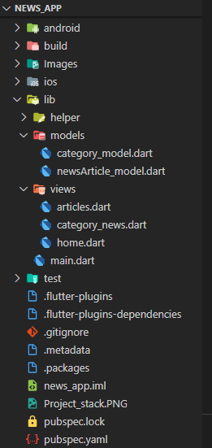

# News_App_in_Flutter
News App developed with Flutter and API from [News API](newsapi.org)

## Flutter:

Flutter is an open-source, UI software development framework (based on Dart language) created by Google. It enables developers to create high-performance apps, with a single codebase for different platforms such as iOS, Android, Windows, Linux, Google Fuchsia, and the Web.

## Project Stack:

## Project Screenshot:
  
